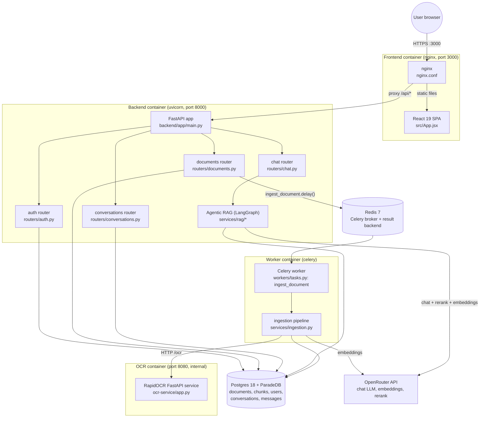

# Architecture

## System diagram

## Components

### Frontend — `src/`
A Vite + React 19 single-page app (no TypeScript, no state-management library beyond React context). Entry point `src/main.jsx` mounts `<App/>` in `StrictMode`. `src/App.jsx` wraps the app in `AuthProvider` (`src/auth/AuthContext.jsx`) and a `react-router-dom` v7 `BrowserRouter` with three routes: `/` (`src/pages/HomePage.jsx`), `/login` (`src/pages/LoginPage.jsx`), and `/chat` (`src/pages/ChatPage.jsx`, gated by `src/components/ProtectedRoute.jsx`). Data access is split between `src/api/client.js` (auth-header injection, 401 handling) and `src/repositories/*` (domain calls for auth/conversations) — document endpoints are called inline from components/hooks rather than through a repository (a deviation from the pattern documented in `CLAUDE.md`). Built by `Dockerfile` (multi-stage `node:22-alpine` build → static files served by `nginx:alpine`).

### nginx — `nginx.conf`, root `Dockerfile`
Serves the built SPA (`try_files ... /index.html` for client-side routing) and reverse-proxies `location /api/` to `http://backend:8000` with `client_max_body_size 20m` and buffering disabled (needed for the chat SSE stream).

### Backend API — `backend/app/main.py`
A single FastAPI app (`app = FastAPI(title="Chatbot API")`, `main.py:24`) with a logging middleware (`main.py:27-31`), CORS from `settings.cors_origins` (`main.py:34-39`), a `/health` endpoint (`main.py:46-48`), and four routers mounted with no extra prefix beyond what each router declares: `documents`, `chat`, `auth`, `conversations` (`main.py:41-44`). Config is a single `pydantic_settings.BaseSettings` class (`backend/app/config.py`) loaded from `.env`. DB access goes through a shared `SessionLocal`/`engine` (`backend/app/database.py`) via the `get_db()` FastAPI dependency.

### Auth — `backend/app/routers/auth.py`, `backend/app/security.py`
JWT-based auth (PyJWT + passlib/bcrypt). There is no signup endpoint — accounts are provisioned out-of-band via `backend/scripts/create_user.py`. Login issues a 24h-default JWT (`config.py:29`); `security.get_current_user` is the shared dependency guarding every router except `/api/auth/login`, `/health`, and (notably) `/api/documents/{id}/status`.

### Document ingestion — `backend/app/routers/documents.py`, `backend/app/workers/`, `backend/app/services/ingestion.py`
Upload is synchronous (validate → save file → insert `Document` row with `status="pending"`), then ingestion is asynchronous via a single Celery task, `ingest_document` (`backend/app/workers/tasks.py`), brokered through Redis (`backend/app/workers/celery_app.py`). The task parses (PyMuPDF for PDFs, python-docx for docx, direct OCR for images), chunks (parent ~1500 tokens / child ~300 tokens, via `langchain-text-splitters`), embeds children (OpenRouter embeddings), and writes `DocumentParentChunk`/`DocumentChunk` rows. Clients poll ingestion progress via an SSE endpoint that reads the `documents.status` column every 2s.

### OCR microservice — `ocr-service/app.py`
A minimal FastAPI service wrapping `rapidocr_onnxruntime.RapidOCR` (PP-OCR ONNX models, no PaddlePaddle dependency). Exposes `GET /health` and `POST /ocr` (multipart image → line-level text + bbox + confidence). Called by the worker's ingestion pipeline only for scanned PDF pages (native text layer under `OCR_MIN_TEXT_CHARS`) and for image uploads; never called directly by the API or frontend.

### Agentic RAG — `backend/app/services/rag/`
A LangGraph state machine (`graph.py`) invoked as `agentic_rag_stream(document_id, message, db)` from `backend/app/routers/chat.py`. Six nodes (`rewrite_query`, `retrieve`, `grade`, `retry`, `generate`, `check` — see `wiki/02-flows.md` for the full graph and per-node detail) implement query rewriting, hybrid retrieval + rerank, a retry loop, grounded answer generation, and a post-hoc faithfulness check. All LLM calls (chat, rerank) and embedding calls go through OpenRouter using `openai`-compatible clients.

### Database — Postgres 18 + ParadeDB (`docker-compose.yml`)
Single Postgres instance (`paradedb/paradedb:0.24.3-pg18`), which bundles both
`pg_search` (BM25) and `pgvector`, holding both the vector/keyword-indexed
document chunks and the app's relational tables (users, conversations,
messages). See `wiki/03-data-model.md`.

### Redis — `docker-compose.yml`
Used exclusively as the Celery broker + result backend (`backend/app/workers/celery_app.py`) — not used for caching or pub/sub elsewhere in the app.

## Cross-cutting notes
- **No API gateway/service mesh** — nginx is the only entry point; internal services (`backend`, `worker`, `ocr`, `redis`, `db`) are reachable only on the docker-compose network.
- **No message queue beyond Celery/Redis** — a single task type (`ingest_document`) is the only asynchronous work in the system; chat is synchronous-but-streamed (SSE) inside a single request/response cycle.
- **Two independent long-lived DB sessions per chat request**: the router's request-scoped session is discarded once the endpoint returns the `StreamingResponse`; a fresh `SessionLocal()` is opened inside the SSE generator (`backend/app/routers/chat.py:53`) because the request-scoped session would be closed by the time streaming actually happens.
