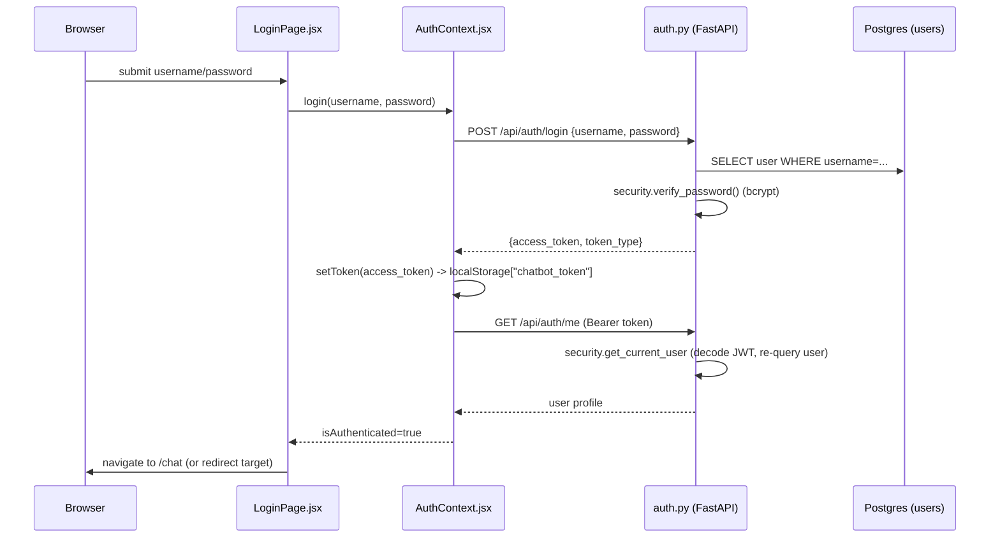
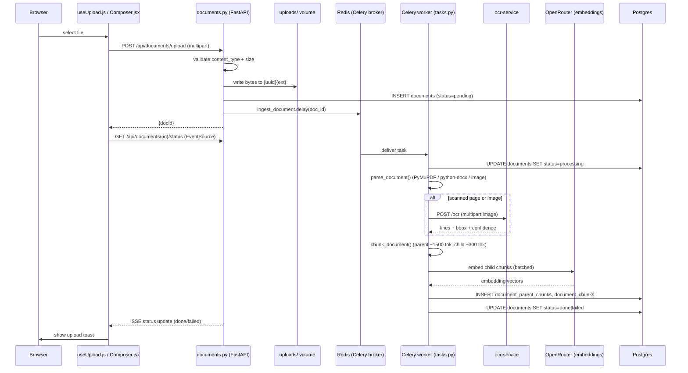
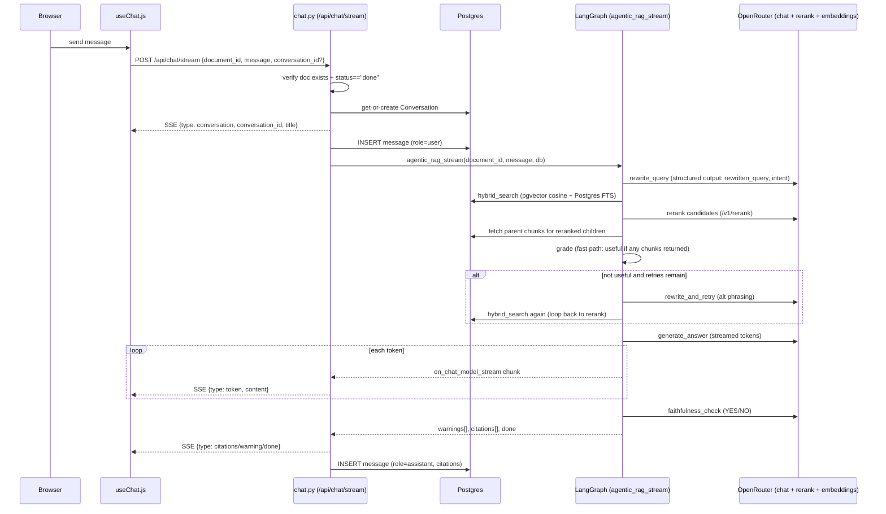
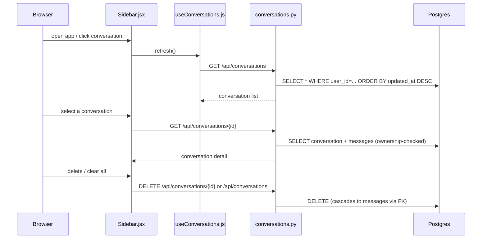
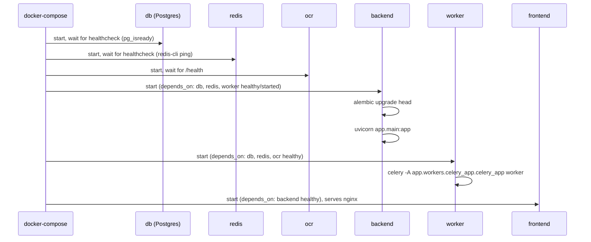

# Flows

## 1. Login (auth)

1. `src/pages/LoginPage.jsx:17-29` `onSubmit` calls `login()` from `useAuth()`.
2. `src/auth/AuthContext.jsx:49-55` `login()` calls `authRepository.js:4-22` `login()` — `POST /api/auth/login`.
3. `backend/app/routers/auth.py:16-31` looks up the `User`, calls `security.verify_password` (bcrypt via passlib), 401 on bad credentials / 403 if inactive.
4. `backend/app/security.py:31-36` `create_access_token` signs a JWT (`sub=username`, `exp` = now + `access_token_expire_minutes`, default 1440 min).
5. `AuthContext.jsx:51` stores the token via `src/api/client.js:14-17` `setToken()` (`localStorage`).
6. `AuthContext.jsx:53` calls `getMe()` (`authRepository.js:24-30`, `GET /api/auth/me`) to hydrate the user; guarded on the backend by `security.get_current_user` (`security.py:39-61`).
7. `src/components/ProtectedRoute.jsx:7-17` now allows navigation to `/chat`.
8. On any subsequent `401`, `src/api/client.js:26-29` clears the token and dispatches a DOM event `auth:unauthorized`, which `AuthContext.jsx:40-47` listens for to log the user out.

## 2. Document upload → ingestion (background job)

1. `src/components/Composer.jsx:37-43` file input → `useUpload.js:12-53` `uploadFile()` — `POST /api/documents/upload` via `apiFetch` (multipart `FormData`, no client-side size/type validation beyond the `accept` attribute).
2. `backend/app/routers/documents.py:35-70` validates extension/MIME against `EXTENSION_MAP` and `MAX_UPLOAD_MB`, writes the file to `settings.upload_dir/{uuid4}{ext}`, inserts a `Document` row (`status="pending"`), and dispatches `ingest_document.delay(str(doc.id))`.
3. `backend/app/workers/celery_app.py:9-17` — Celery app `"chatbot"`, broker/backend both `settings.redis_url`, JSON serialization only.
4. `backend/app/workers/tasks.py:13-64` `ingest_document` (bind=True, max_retries=1): sets `status="processing"`, then:
   - `backend/app/services/ingestion.py:126-148` `parse_document()` dispatches by extension. PDFs (`:81-104`) keep a page's native text if it has ≥ `settings.ocr_min_text_chars` (default 20) non-whitespace chars; otherwise the page is rasterized at `settings.ocr_dpi` (200) and sent to OCR.
   - `backend/app/services/ocr_client.py:27-61` `ocr_image()` — HTTP POST to `settings.ocr_service_url + "/ocr"` (only when `settings.ocr_enabled`); OCR failures degrade just that page to empty text.
   - `ingestion.py:184-214` `chunk_document()` — one parent chunk per page (`RecursiveCharacterTextSplitter`, 1500 tokens, `cl100k_base`), then child chunks (300 tokens, 50 overlap) per parent.
   - `ingestion.py:237-254` `embed_chunks()` — batches of 100 through an OpenAI-SDK client pointed at OpenRouter (`settings.openai_embedding_model`, `dimensions=settings.embedding_dim`).
   - `ingestion.py:259-303` `store_chunks()` — bulk-inserts `DocumentParentChunk` rows, then `DocumentChunk` rows referencing `parent_id`.
5. `tasks.py:43-48` sets `status="done"` + metadata on success; any exception sets `status="failed"` + truncated `error_msg` and retries once (`tasks.py:56-62`).
6. `backend/app/routers/documents.py:73-103` — `GET /api/documents/{id}/status` is an SSE endpoint (no auth dependency) polling a fresh `SessionLocal()` every 2s until `done`/`failed`.
7. `src/hooks/useUpload.js:34-52` opens a real `EventSource` on that endpoint; on `done` it calls `onComplete`, which `src/pages/ChatPage.jsx` uses to show `UploadToast.jsx`.

## 3. Chat request — agentic RAG (the core flow)

1. `src/components/Composer.jsx:10-20` → `src/hooks/useChat.js:63-128` `handleSend()` — `POST /api/chat/stream` via `apiFetch`, with an `AbortController` for cancellation.
2. `backend/app/routers/chat.py:29-39` — `Depends(get_current_user)` gate; 404 if the document doesn't exist, 400 if `doc.status != "done"`.
3. `chat.py:52-91` — inside `event_stream()`: resolves or creates the `Conversation` (ownership-checked if `conversation_id` was supplied), yields a `conversation` SSE event, then persists the user's `Message` immediately — all on a **fresh** `SessionLocal()` (`chat.py:53`), not the request-scoped session.
4. `chat.py:96-98` calls `agentic_rag_stream(document_id, message, stream_db)` (`backend/app/services/rag/graph.py:80-122`), which builds and runs the LangGraph (`build_graph`, `graph.py:38-61`):
   - `rewrite_query` (`nodes.py:34-49`) — LLM structured-output call classifying `intent` and producing a cleaned search query.
   - `retrieve` (registered node id; function `retrieve_and_rerank`, `nodes.py:56-71`) — calls `retrieval.retrieve()` (`retrieval.py:139-161`): `hybrid_search` (pgvector cosine `ORDER BY embedding.cosine_distance` + Postgres FTS `ts_rank`/`plainto_tsquery`, `retrieval.py:22-67`) → `rrf_fuse` (Reciprocal Rank Fusion, `k=60`, `retrieval.py:70-77`) → `rerank()` via OpenRouter `/v1/rerank` (`reranker.py:34-96`, top 6) → `apply_metadata_boost` (no-op by default, `retrieval.py:109-136`) → `fetch_parents` (dedup parent chunks, `retrieval.py:88-106`).
   - `grade` (function `grade_chunks`, `nodes.py:74-115`) — **default fast path**: `graded_useful=True` if any chunks were retrieved (not an LLM call unless `settings.strict_grader=True`).
   - `route_after_grade` (`graph.py:30-35`) — routes to `retry` if not useful and `retry_count < settings.max_retrieval_retries` (default 2), else to `generate` either way (useful or "give up").
   - `retry` (function `rewrite_and_retry`, `nodes.py:118-129`) — LLM proposes one alternate query phrasing, loops back to `retrieve`.
   - `generate` (function `generate_answer`, `nodes.py:143-161`) — builds context from parent chunks prefixed `[page N]`, calls the chat LLM with `ANSWER_SYSTEM_GROUNDED` or `ANSWER_SYSTEM_NOT_FOUND` depending on `graded_useful`. Token-level streaming is captured at the graph level (`graph.py:94-101`, filtered to `langgraph_node == "generate"`), not inside this node.
   - `check` (function `faithfulness_check`, `nodes.py:164-184`) — LLM YES/NO on whether the draft answer is fully supported by context; appends a `warnings` entry on `NO`.
5. `graph.py:112` yields a `citations` event built from the reranked **children** (not parents), deduped by `chunk_index`, each truncated to 400 chars.
6. `chat.py:99-108` forwards every yielded event verbatim as `data: {json}\n\n` (SSE, `StreamingResponse(..., media_type="text/event-stream")`, `chat.py:127`); on an exception mid-stream it yields an `error` event and skips persisting an assistant message.
7. `chat.py:110-123` — on clean completion, persists the assistant `Message` (with `citations`) and bumps `conv.updated_at`.
8. Frontend: `useChat.js:94-121` hand-rolls SSE-over-`fetch` parsing (not `EventSource`, since this is a POST) and dispatches `token`/`citations`/`done`/`error` into thread state; `src/components/ChatMessage.jsx:78-79` shows `ThinkingIndicator.jsx` until the first token arrives.

## 4. Conversation history (list / load / delete)

1. `src/hooks/useConversations.js:8-39` — `refresh()` calls `conversationRepository.js:5-9` `listConversations()` (`GET /api/conversations`) on mount.
2. `backend/app/routers/conversations.py:17-27` filters by the authenticated `user_id`, orders by `updated_at DESC`.
3. Selecting a row: `src/components/Sidebar.jsx:78-101` → `src/pages/ChatPage.jsx:40-51` `onSelectConversation` → `conversationRepository.js:11-15` `getConversation(id)` → `backend/app/routers/conversations.py:30-45` (404 if not owned by the current user) → `useChat.js:131-143` `loadMessages()` replaces thread state.
4. Delete one: `Sidebar.jsx` → `useConversations.js:28-31` `remove()` → `conversationRepository.js:17-20` → `DELETE /api/conversations/{id}` (`conversations.py:61-83`) — cascades to `messages` via the FK's `ON DELETE CASCADE`.
5. Clear all: `useConversations.js:33-36` `clearAll()` → `DELETE /api/conversations` (`conversations.py:85-...`), bulk-deletes all of the user's conversations.
6. **New conversation is not created here** — it is implicitly created server-side on the first `/api/chat/stream` call (see Flow 3, step 3) and only appears in this list after `useChat.js`'s `conversation` SSE event triggers `ChatPage.jsx:26-29` `handleConversation` → `refresh()`.

## 5. Application startup

1. `docker-compose.yml` defines explicit `depends_on: condition: service_healthy` ordering: `db`/`redis`/`ocr` must pass their healthchecks before `backend`/`worker` start; `backend` must be healthy before `frontend` starts.
2. `backend/Dockerfile:10` — container command is `alembic upgrade head && uvicorn app.main:app --host 0.0.0.0 --port 8000`, i.e. migrations run on every backend container start, before the API accepts traffic.
3. `backend/app/main.py:13-21` configures logging (console + rotating file handler at `/app/logs/backend.log`) at import time, before routers are registered.
4. `backend/app/workers/celery_app.py:22-27` registers an `after_setup_logger` signal handler (rotating file handler at `/app/logs/worker.log`) and a `worker_ready` signal that logs registered task names (`:30-35`).
5. No explicit application-level startup/shutdown event handlers (no `@app.on_event`) exist in `main.py` — engine/session setup in `database.py` happens at import time via module-level `create_engine`/`sessionmaker`.
