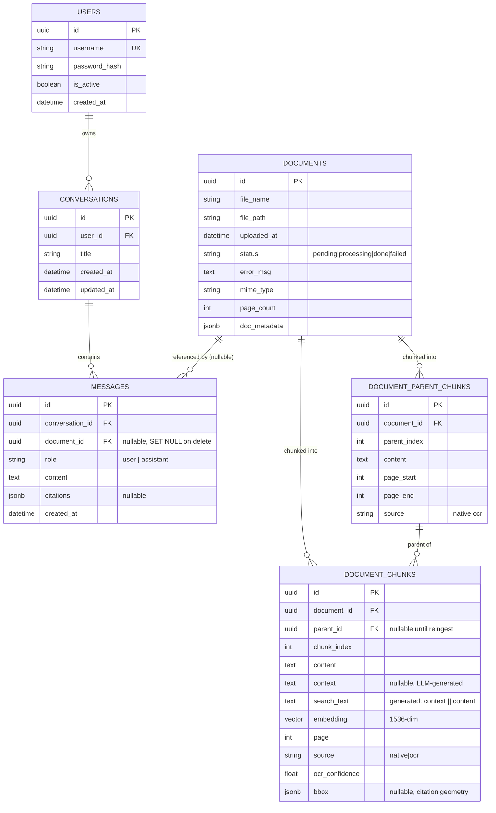

# Data Model

Single Postgres 18 database (`paradedb/paradedb`, which bundles `pg_search` and
`pgvector`, see `docker-compose.yml` — note the volume mounts
`/var/lib/postgresql/`, not `/var/lib/postgresql/data`, for the Postgres 18
layout), schema owned entirely by SQLAlchemy models in `backend/app/models.py`
and versioned via Alembic (`backend/alembic/versions/`). No other datastore holds
relational/vector data — Redis is Celery-only (see `wiki/04-integrations.md`).

## ERD

## Tables

### `documents` (`Document`, `models.py:8-21`)
The upload/ingestion record. `status` drives the whole ingestion state machine (`pending → processing → done|failed`); `doc_metadata` (JSONB) holds free-form ingestion facts (`ocr_engine`, `ocr_pages`, `native_pages`, etc.).
- **Writes**: `backend/app/routers/documents.py` (insert on upload), `backend/app/workers/tasks.py` (status transitions + metadata on completion/failure), `backend/scripts/reingest_all.py` (re-runs ingestion for existing docs).
- **Reads**: `routers/documents.py` (list/status), `routers/chat.py` (gates chat on `status == "done"`), `services/rag/retrieval.py` (scopes chunk queries by `document_id`).

### `document_parent_chunks` (`DocumentParentChunk`, `models.py:24-42`)
One row per page-derived "parent" passage (~1500 tokens), unique on `(document_id, parent_index)`. This is what's formatted into LLM context — never searched directly.
- **Writes**: `backend/app/services/ingestion.py:store_chunks()`.
- **Reads**: `backend/app/services/rag/retrieval.py:fetch_parents()` (looked up by the `parent_id`s of reranked children).

### `document_chunks` (`DocumentChunk`, `models.py:45-69`)
One row per "child" passage (~300 tokens, 50-token overlap), the retrieval unit.
Carries the `pgvector` `embedding` column (`Vector(1536)`, migration
`0005_embedding_to_1536.py`), OCR provenance (`source`, `ocr_confidence`),
citation geometry (`bbox`, migration `0009`), and — since migration `0010` — the
generated `context` plus a `search_text` STORED generated column
(`coalesce(context,'') || ' ' || content`) that the `chunks_bm25` ParadeDB index
covers. `context` is nullable and NULL is fully supported: those rows retrieve on
content alone. `parent_id` is nullable "until reingest completes" per the model
comment.
- **Writes**: `services/ingestion.py:store_chunks()` (including `context`);
  wiped and rebuilt per-document by `scripts/reingest_all.py`. `search_text` is
  computed by Postgres — never assigned.
- **Reads**: `services/rag/retrieval.py` — vector similarity
  (`embedding.cosine_distance`) and a keyword arm over `search_text` (BM25 via
  `pg_search`, or the `ts_rank` fallback) in `hybrid_search()`, then re-fetched
  by id after weighted RRF fusion in `fetch_chunks_by_ids()`.

### `users` (`User`, `models.py:72-79`)
Login accounts. `username` is unique + indexed. No self-service signup — the only writer is a CLI script.
- **Writes**: `backend/scripts/create_user.py` only.
- **Reads**: `backend/app/routers/auth.py` (login lookup), `backend/app/security.py:get_current_user()` (re-queried on every authenticated request from the JWT `sub` claim).

### `conversations` (`Conversation`, `models.py:82-102`)
One thread per chat session, scoped to a user (`ON DELETE CASCADE` from `users`). `title` defaults to a truncated version of the first user message. `updated_at` has an `onupdate` trigger, bumped whenever a new message is added, so the sidebar can sort by recency.
- **Writes**: `backend/app/routers/chat.py` (get-or-create on first message of a thread, `updated_at` bump on assistant reply), `backend/app/routers/conversations.py` (delete one / delete all).
- **Reads**: `routers/conversations.py` (list/get, scoped to `user_id` for ownership checks), `routers/chat.py` (ownership check when a `conversation_id` is supplied).

### `messages` (`Message`, `models.py:105-128`)
Individual chat turns. `document_id` is a **nullable, `SET NULL`-on-delete** FK — a message survives its source document being deleted, but loses the reference. `citations` (JSONB) is populated only on assistant messages, from the RAG graph's `citations` SSE event.
- **Writes**: `backend/app/routers/chat.py` only — both the user turn (persisted immediately) and the assistant turn (persisted only on clean stream completion, skipped on error).
- **Reads**: `backend/app/routers/conversations.py:get_conversation()` (ordered message list for a thread).

## Migration history (`backend/alembic/versions/`)

| Revision | File | Change |
|---|---|---|
| 0001 | `0001_initial.py` | `vector` extension, `documents`, `document_chunks` (`Vector(1536)` + HNSW index) |
| 0002 | `0002_fix_embedding_dim.py` | `document_chunks.embedding` → `Vector(2560)` (since-abandoned Ollama model; drops HNSW, notes the pgvector 2000-dim index cap) |
| 0003 | `0003_add_fts_gin_index.py` | GIN index on `to_tsvector('english', content)` for full-text search |
| 0004 | `0004_parent_child_chunks.py` | Adds `document_parent_chunks` + `document_chunks.parent_id` FK |
| 0005 | `0005_embedding_to_1536.py` | `embedding` → `Vector(1536)` (current, `text-embedding-3-small`-class dim); re-adds HNSW index (now under the 2000-dim cap) |
| 0006 | `0006_document_metadata.py` | Adds `documents.mime_type/page_count/doc_metadata`; `document_parent_chunks.page_start/page_end/source`; `document_chunks.page/source/ocr_confidence` + composite index |
| 0007 | `0007_create_users.py` | Creates `users` + unique index on `username` |
| 0008 | `0008_create_conversations_messages.py` | Creates `conversations` + `messages` with the FKs described above |
| 0009 | `0009_chunk_bbox.py` | Adds `document_chunks.bbox` (JSONB citation geometry), nullable, no backfill |
| 0010 | `0010_contextual_retrieval.py` | `pg_search` extension; `document_chunks.context` + `search_text` generated column; `chunks_bm25` BM25 index |

Run via `alembic upgrade head`, executed automatically on every backend container start (`backend/Dockerfile:10`). After a chunk-schema migration, `python -m scripts.reingest_all` rebuilds chunks/embeddings from source files in `uploads/` (per `CLAUDE.md`).
